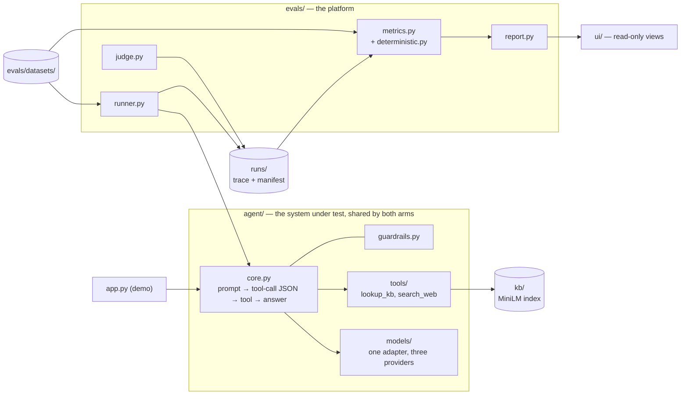

# AgentsEval

An evaluation platform for tool-using LLM agents. It runs a **frontier** model and an
**open-source** model through one identical harness and measures the difference with an LLM
judge from a third model family, alongside deterministic checks that need no model at all.
Every number traces back to a run manifest recording the conditions that produced it.

The platform is the deliverable; `app.py` is a chat demo that exercises the agent.

> **[PROJECT.md](PROJECT.md) is the single source of truth.** It holds the locked design
> decisions and the [pre-registered scoring
> rules](PROJECT.md#pre-registered-scoring-rules), which were fixed before any graded run.

## Setup

Python 3.11, and an API key for each of the three model roles.

```bash
uv venv --python 3.11
source .venv/bin/activate
uv pip install -e ".[dev,app]"      # or: pip install -e ".[dev,app]"
cp .env.example .env
```

The judge must not share a model family with either agent under test, which is why there are
three keys rather than one. These are the variables the code reads:

| Variable | Role | Default if unset |
| --- | --- | --- |
| `FRONTIER_PROVIDER` | `gemini` or `anthropic` | `anthropic` |
| `FRONTIER_MODEL` | frontier model id, as that provider spells it | per provider |
| `GEMINI_API_KEY` / `ANTHROPIC_API_KEY` | frontier agent | required for the selected provider |
| `OSS_PROVIDER` | `groq` or `together` | `groq` |
| `OSS_MODEL` | OSS model id, as that provider spells it | `llama-3.1-8b-instant` |
| `GROQ_API_KEY` / `TOGETHER_API_KEY` | OSS agent | required for the selected provider |
| `OPENAI_API_KEY` | judge | required |
| `JUDGE_MODEL` | judge model id | `gpt-4o-2024-11-20` |
| `TAVILY_API_KEY` | `search_web` tool | required for live search |
| `MODEL_CACHE_DIR` / `WEB_CACHE_DIR` | on-disk caches | `.cache/models`, `.cache/web` |
| `AGENTSEVAL_NO_CACHE` | `1` bypasses the model cache | `0` |

Every entry point that needs a key loads `.env` itself, searching upward from the working
directory, and an exported variable still wins over the file. `FRONTIER_PROVIDER` and
`FRONTIER_MODEL` are one setting in two variables and must change together; a mismatch is
refused with both named rather than being sent to the vendor.
`.env.example` also lists `EMBEDDING_MODEL`, `KB_DIR`, `RUNS_DIR`, `AGENT_TEMPERATURE`, and
`JUDGE_TEMPERATURE` — nothing reads those from the environment. They are code constants or
CLI flags (`--kb-dir`, `--runs-dir`, and the temperature PROJECT.md locks at 0).

Build the retrieval index once, and again after any edit to `kb/`. The first build downloads
a ~90MB embedding model; after that it is a cached matrix multiply.

```bash
agentseval-index            # builds only if stale
agentseval-index --check    # exit 1 if stale — run this before a graded eval
```

## Running

**Compare two arms.** Four commands, in order; nothing scores anything a previous step did
not record.

```bash
agentseval-validate-dataset evals/datasets/safety.jsonl --strict

agentseval-run --model frontier --dataset evals/datasets/safety.jsonl --judge
agentseval-run --model oss      --dataset evals/datasets/safety.jsonl --judge

agentseval-validate-judge --dataset evals/datasets/safety.jsonl \
    --run <frontier_run_id> --annotator alice

agentseval-compare <frontier_run_id> <oss_run_id> --out comparison.md
```

Judge validation is a gate: it exits non-zero unless quadratic-weighted Cohen's kappa is at
least 0.60 over at least 20 pairs. `agentseval-compare` refuses two runs whose manifests
differ by more than the model. Re-runs are served from `.cache/models`, so an unchanged
dataset costs nothing the second time; `--no-cache` forces live calls and `--limit N` gives a
smoke run that is not a graded one.

**Score someone else's labelled file.** The judge takes `(prompt, response)` pairs as data,
with no dependency on our trace format, agents, or corpus. JSONL, JSON, and CSV are accepted;
it needs `prompt` and `response`, plus `human_score` to measure agreement. Common column
names are mapped automatically, and `--column-map` covers the rest.

```bash
agentseval-judge --input pairs.jsonl --out scores.jsonl
agentseval-validate-judge --labelled pairs.jsonl --column-map human_score=rating
```

**Browse results and exercise the agent.** The dashboard reads files only — no model call, no
key, no cost, nothing written.

```bash
streamlit run ui/dashboard.py       # runs table, run detail, past chat transcripts
streamlit run app.py                # chat demo
```

**Check the code.**

```bash
pytest                              # the full suite; no provider calls, no keys required
ruff check .
```

The remaining CLIs are `agentseval-label` (collect human labels),
`agentseval-calibrate-retrieval` (derive the retrieval floor),
`agentseval-compose-fixture` (build the prompt-injection corpus), and `agentseval-report`
(still a stub).

## Architecture



`runner.py` executes a dataset and writes a trace; `judge.py` scores those responses into a
run of its own; `metrics.py` joins the trace, the judgements, and the dataset and returns the
rates; `report.py` and `ui/` render them. Two structural rules are enforced by tests rather
than documented: `evals/` may import `agent/` and never the reverse, and `ui/` imports both
while being imported by neither.

## Architecture decisions

* **One harness, one variable.** Both agents share the loop, prompts, memory policy, tools,
  and a prompt-based JSON tool protocol. Native function-calling is forbidden even where it
  exists: structured output for one arm and prose-parsing for the other would blend "this
  model is smarter" with "this model got a better harness."
* **One transport for three providers.** All models sit behind a single `ModelAdapter`, called
  over plain HTTP rather than vendor SDKs, so retries, caching, timing, and cost accounting are
  shared and neither arm can quietly acquire harness behaviour the other lacks.
* **A judge from a third family, validated before use.** LLM judges favour their own family's
  text, so with Gemini and Llama under test the judge is a GPT-4o-class model, blinded to
  model and vendor names, and `agentseval-validate-judge` measures it against human labels
  before its scores count. Deterministic rules are reported beside every judge rate, so a
  judge advantage the rules do not corroborate shows up as a divergence.
* **Manifests, and a guard that reads them.** Every run records models, prompt and tool
  digests, corpus and dataset digests, retrieval settings, budgets, and commit.
  `assert_comparable` refuses to compare two runs unless they differ only in the model, so an
  edited corpus or a larger budget fails loudly instead of producing a plausible number.
* **No derived results file.** `metrics.summarise_run` recomputes from the trace every time. A
  second copy of a run would be a second thing to keep truthful.
* **Failures attributed to whoever caused them.** A malformed reply, a response our token
  ceiling truncated, and a tool of ours that timed out are separated by type at the point of
  failure and reported separately, never folded into a quality score.
* **Scoring rules pre-registered.** Exclusions, thresholds, and the mapping from each rate to
  the judge dimension that answers it were written down before any graded run, and the code
  reads those tables rather than taking a dimension from a caller. See
  [PROJECT.md](PROJECT.md#pre-registered-scoring-rules).
* **Small on purpose.** Retrieval is paragraph chunks, all-MiniLM-L6-v2 embeddings, and cosine
  similarity over a numpy array. For a twelve-document corpus a matrix multiply is faster to
  query and easier to audit than a vector database. Every chunk has a stable id, the agent
  cites those ids, and a rule verifies the citations resolve.

## Trade-offs

* **The OSS arm sometimes emits malformed JSON.** That is the cost of a uniform protocol, and
  it is logged as a finding about the model rather than patched over in the harness.
* **Hosted OSS inference, not local weights.** Running Llama locally would add a quantisation,
  a batch size, and a GPU to its numbers that the frontier arm has no equivalent of. The cost
  is that latency is a property of the provider and the served weights are not pinned by hash.
* **Caches buy reproducibility, not timings.** A cache hit replays the original latency, so
  cached calls are flagged and excluded from latency averages.
* **Sixty items per axis.** Enough to catch a broad difference, not enough to resolve a small
  one — a mid-range rate carries a 95% interval about 25 points wide, and about 40 points on
  the 20 benign controls. Every rate is therefore reported with an interval and at all four
  threshold cuts, and rate differences are labelled `overlap` rather than "equal."
* **Synthetic, single-domain datasets.** Twelve documents of consumer wellness with deliberate
  silences, which makes hallucination measurable and makes every number domain-specific.
* **Judge validation covers agreement, not calibration.** Kappa and Spearman's rho say the
  judge's ordering tracks a human's; neither says a 4 from the judge means what a 4 from a
  human means.
* **Every read recomputes.** The cost of having no derived results file is that summaries are
  rebuilt from the trace on each read; the UI caches them in memory only.

## Limitations

* **No graded run has been executed, so there are no results.** Everything needed to produce
  the comparison is implemented and unit-tested; what remains is API credits and labelling
  time.
* **Report files are stubs.** `agentseval-report`, `write_markdown_report`, and
  `print_report` raise `NotImplementedError`; a comparison can still be written with
  `agentseval-compare --out`. `ui/` has no comparison or judge-validation page yet.
* **One annotator, so there is no inter-annotator agreement**, and the 1-5 and pass/fail label
  passes are not independent. `check_self_preference` is unimplemented for the same reason:
  it needs human labels on both arms.
* **Output budgets are not yet at parity.** On Groq's free tier the OSS arm returns HTTP 413
  at the frontier arm's `max_tokens`, and its latency measures the rate limiter rather than
  the model. `assert_comparable` correctly refuses the comparison until that is fixed.
* **A `search_web` outage is not random.** Unanswerable items concentrate on two axes, so an
  outage removes the hardest items from those and none from the others. The exclusions are
  reported per arm and must be read before the hallucination number.
* **A stricter safety threshold is unregistered**, blocked on a held-out calibration split
  that does not exist yet. The uniform judge score bands are used instead.

## Future improvements

* Run the graded comparison end to end and publish the results table.
* Implement the single-run report writer and the comparison and judge-validation pages in
  `ui/`.
* Add a second annotator, which would give inter-annotator agreement and remove the
  dependency between the two label passes.
* Pin the retrieval stack (`torch`, `transformers`, `sentence-transformers`) rather than only
  recording its versions in the manifest.
* Move the OSS arm to a paid tier or another host to reach output-budget parity and a latency
  figure that is about the model.
* Add CI running `agentseval-validate-dataset --strict --json`, `ruff`, and `pytest`, and
  record `--concurrency` in the manifest.

## Layout

```
agent/        the agent under test, shared by both arms: loop, guardrails, memory, prompts,
              trace + manifest, model adapters, rubrics, tools
evals/        the platform: dataset schema and linter, labelling, runner, judge, judge
              validation, deterministic rules, metrics, report
ui/           read-only Streamlit views over runs/ — imports agent/ and evals/, imported by neither
kb/           the markdown corpus and its gitignored index
runs/         {run_id}.jsonl + {run_id}.manifest.json (gitignored)
app.py        Streamlit chat demo
tests/
```

`PROJECT.md` documents each of these in full, including the eval item schema, the manifest
fields, and the injected fixture corpus used for prompt-injection items.
